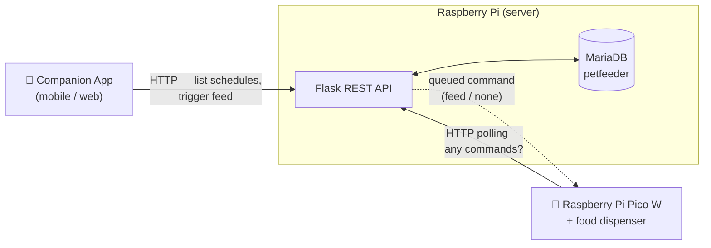
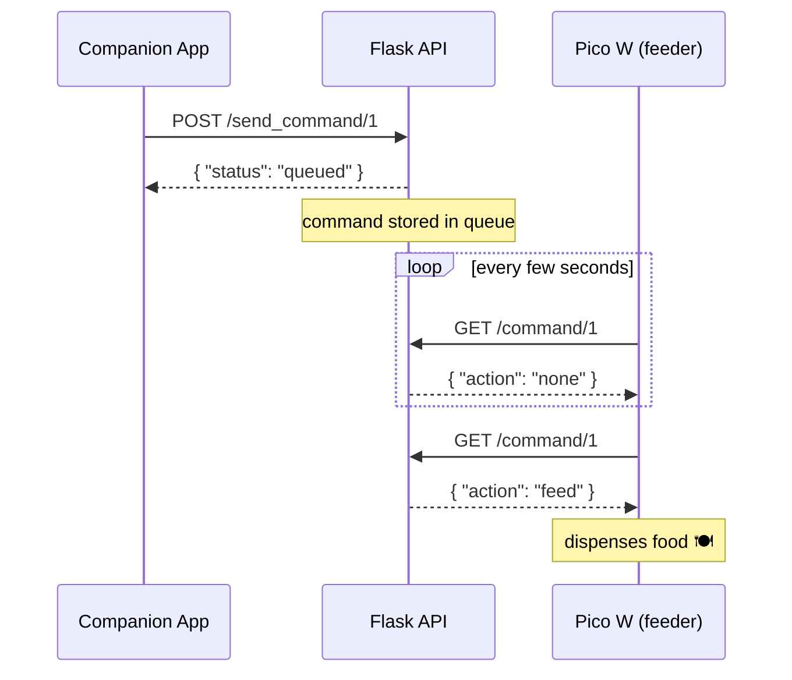

# 🐾 Smart Pet Feeder

> A self-hosted IoT pet feeding system. A Flask REST API backed by MariaDB runs on a Raspberry Pi, a Raspberry Pi Pico W dispenses the food, and a companion app lets you feed your pet on demand from anywhere on your network.


---

## Table of Contents

- [Overview](#overview)
- [Features](#features)
- [Architecture](#architecture)
- [How Feeding Works](#how-feeding-works)
- [Tech Stack](#tech-stack)
- [Hardware](#hardware)
- [Getting Started](#getting-started)
- [Database Schema](#database-schema)
- [API Reference](#api-reference)
- [Controlling the Feeder From the App](#controlling-the-feeder-from-the-app)
- [Project Structure](#project-structure)
- [Security & Production Notes](#security--production-notes)
- [Roadmap](#roadmap)
- [License](#license)

---

## Overview

Smart Pet Feeder lets you feed your pet remotely and keep your feeding schedules in one place. The system is split into three parts that talk to each other over your local network:

- A **Flask REST API** (this repository) that exposes feeding data and queues feed commands.
- A **MariaDB** database that stores feeding options.
- A **Raspberry Pi Pico W** attached to the physical feeder that polls the API and dispenses food when a command is waiting.

A **companion app** sits on top of the API so you can view your schedules and trigger a feed from your phone or browser.

---

## Features

- 📋 **Feeding options** — store and retrieve named feeding schedules from the database.
- 🍽️ **Feed on demand** — trigger an immediate feed from the app with a single request.
- 🔁 **Polling command queue** — a lightweight, microcontroller-friendly model that avoids pushing connections to the device.
- 🆔 **Multi-feeder support** — every command endpoint is addressed by `feeder_id`, so a single server can drive more than one feeder.
- 📱 **App-controlled** — all functionality is exposed over a clean HTTP API for the companion app to consume.

---

## Architecture



The design uses three tiers:

1. **App (client)** — talks only to the API. It never communicates with the hardware directly.
2. **Raspberry Pi (server)** — runs the Flask API and the MariaDB database. It is the single source of truth and the coordination point between the app and the feeder.
3. **Pico W (controller)** — connects to Wi-Fi and physically dispenses food. Because microcontrollers can't easily accept incoming connections, it *pulls* work from the server instead of having work pushed to it.

---

## How Feeding Works

The feeder uses a **pull (polling) model** rather than pushing commands to the device:



1. The app sends `POST /send_command/<feeder_id>`. The server stores a `{ "action": "feed" }` command in an in-memory queue and replies `{ "status": "queued" }`.
2. The Pico W repeatedly calls `GET /command/<feeder_id>` on a short interval.
3. When a command is waiting, the server returns it **and removes it from the queue**, so it only runs once. The Pico W then dispenses the food.
4. When nothing is queued, the server returns `{ "action": "none" }` and the Pico W keeps polling.

---

## Tech Stack

| Layer | Technology |
|-------|------------|
| API / Backend | Python, Flask |
| Database | MariaDB |
| DB Driver | `mariadb` (MariaDB Connector/Python) |
| Server host | Raspberry Pi |
| Feeder controller | Raspberry Pi Pico W (MicroPython) |
| Client | Companion app (mobile / web) |

---

## Hardware

- **Raspberry Pi** — any model that runs Python and MariaDB (e.g. Pi 3 / 4 / 5 or Zero 2 W). Hosts the API and database.
- **Raspberry Pi Pico W** — Wi-Fi microcontroller that drives the dispenser.
- **Servo or motor + driver** — the mechanism that actually releases the food.
- **Misc.** — power supplies, food hopper/chute, and wiring.

---

## Getting Started

These steps cover the server (this repository). The Pico W firmware and the companion app are separate components.

### Prerequisites

- Python 3.x
- A running MariaDB server
- The MariaDB **Connector/C** library installed on the host (required by the `mariadb` Python package)

```bash
# Debian / Raspberry Pi OS example
sudo apt update
sudo apt install libmariadb3 libmariadb-dev
```

### 1. Clone the repository

```bash
git clone https://github.com/<your-username>/petfeeder.git
cd petfeeder
```

### 2. Install Python dependencies

```bash
pip install flask mariadb
```

### 3. Set up the database

```sql
CREATE DATABASE IF NOT EXISTS petfeeder;
USE petfeeder;

CREATE TABLE feeder_options (
    id           INT AUTO_INCREMENT PRIMARY KEY,
    name         VARCHAR(100) NOT NULL,
    type         VARCHAR(50),
    time         TIME,
    time_hours   INT,
    time_minutes INT
);

-- Optional sample row
INSERT INTO feeder_options (name, type, time, time_hours, time_minutes)
VALUES ('Morning Feed', 'scheduled', '08:00:00', 8, 0);
```

### 4. Configure the database connection

Edit the `config` dictionary in `sql_connector.py` to match your setup:

```python
config = {
    'host': '127.0.0.1',
    'port': 3306,
    'user': 'petfeeder_user',   # use a dedicated, non-root user
    'password': 'your-password', # set a real password
    'database': 'petfeeder'
}
```

### 5. Run the server

```bash
python main.py
```

The API starts on `0.0.0.0:5000`, making it reachable from other devices on the network (the app and the Pico W) at `http://<server-ip>:5000`.

---

## Database Schema

**`feeder_options`**

| Column | Type | Description |
|--------|------|-------------|
| `id` | `INT` (PK, auto-increment) | Unique identifier for the feeding option |
| `name` | `VARCHAR` | Human-readable label (e.g. "Morning Feed") |
| `type` | `VARCHAR` | Category of the option (e.g. scheduled / manual) |
| `time` | `TIME` | Time of day for the feed |
| `time_hours` | `INT` | Hours component of the time |
| `time_minutes` | `INT` | Minutes component of the time |

---

## API Reference

Base URL: `http://<server-ip>:5000`

| Method | Endpoint | Used by | Description |
|--------|----------|---------|-------------|
| `GET` | `/feeder` | App | Returns all configured feeding options |
| `GET` `POST` | `/send_command/<feeder_id>` | App | Queues a `feed` command for the given feeder |
| `GET` | `/command/<feeder_id>` | Pico W | Returns and clears any queued command for the feeder |

### `GET /feeder`

Returns every feeding option in the database.

```bash
curl http://<server-ip>:5000/feeder
```

**`200 OK`**

```json
[
  {
    "id": 1,
    "name": "Morning Feed",
    "type": "scheduled",
    "time": "08:00:00",
    "time_hours": 8,
    "time_minutes": 0
  }
]
```

### `POST /send_command/<feeder_id>`

Queues an immediate feed command for the specified feeder.

```bash
curl -X POST http://<server-ip>:5000/send_command/1
```

**`200 OK`**

```json
{ "status": "queued" }
```

### `GET /command/<feeder_id>`

Polled by the Pico W. Returns the queued command and removes it, or `none` if nothing is pending.

```bash
curl http://<server-ip>:5000/command/1
```

**`200 OK` — command waiting**

```json
{ "action": "feed" }
```

**`200 OK` — nothing queued**

```json
{ "action": "none" }
```

---

## Controlling the Feeder From the App

The companion app uses only the public API:

- **Show schedules** — call `GET /feeder` to list the configured feeding options.
- **Feed now** — call `POST /send_command/<feeder_id>` to queue a feed; the next time the Pico W polls, it dispenses food.

Because the app and the device communicate only through the server, the app never needs to know the Pico W's address or be online at the same moment the feed happens.

---

## Project Structure

```text
petfeeder/
├── main.py            # Flask app: routes & API endpoints
├── sql_connector.py   # MariaDB connection handling (per-request via Flask g)
├── requirements.txt   # Python dependencies
└── README.md          # This file
```

> The Pico W firmware and the companion app typically live in their own directories or repositories.

---

## Security & Production Notes

- 🔑 **Empty database password** — the default config uses the `root` user with no password. Set a strong password and use a dedicated, non-root database user.
- 🐞 **Debug mode** — `debug=True` enables the interactive Werkzeug debugger and should be turned **off** in production.
- 🌐 **Production server** — Flask's built-in server isn't meant for production traffic; run behind a WSGI server such as Gunicorn or Waitress, ideally with a reverse proxy.
- 🔓 **No authentication** — any device on the network can call `/send_command`. Add an API key or token before exposing the service beyond your LAN, and use HTTPS.
- 💾 **In-memory command queue** — queued commands live in a Python dictionary, so they are lost on restart and are not shared across multiple worker processes.

---

## Roadmap

- [ ] Persist the command queue (database or Redis) so it survives restarts and works across workers
- [ ] Replace polling with MQTT or WebSockets for lower latency and less network traffic
- [ ] Server-side scheduler that runs `feeder_options` schedules automatically
- [ ] Feed history / logging table
- [ ] Authentication (API keys or JWT) and HTTPS
- [ ] Full CRUD endpoints for creating, updating, and deleting feeder options
- [ ] App notifications when a feed completes

---

## License

Specify a license here (e.g. [MIT](https://choosealicense.com/licenses/mit/)). Add a `LICENSE` file to the repository root.
